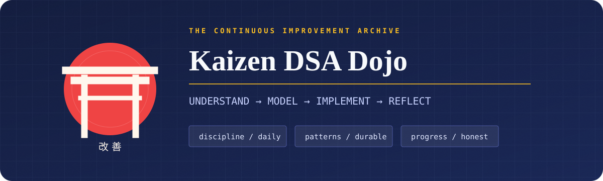
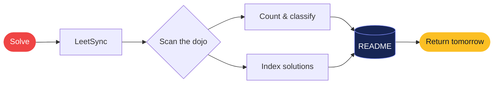

<div align="center">



<br>

[](#-solution-vault)
[](.github/workflows/update-readme.yml)
[](LICENSE)

**[Dashboard](#-dojo-dashboard) · [Solutions](#-solution-vault) · [Method](#-the-kaizen-loop) · [Automation](#-the-invisible-caretaker)**

</div>

> **道場訓 · Dōjō kun** — Never collect solutions. Collect better ways of thinking.

## 戦績 · Dojo dashboard

<!-- LEETSYNC:STATS:START -->
| Problems solved | Easy | Medium | Hard | Languages |
|:---:|:---:|:---:|:---:|:---:|
| **1** | 🟢 0 | 🟡 0 | 🔴 0 | C |
<!-- LEETSYNC:STATS:END -->

<!-- LEETSYNC:INSIGHTS:START -->
**Next belt · 1 / 25 problems**

`░░░░░░░░░░` **4%**

**Language forms**  
`C         ` ▰▰▰▰▰▰▰▰ &nbsp; 1
<!-- LEETSYNC:INSIGHTS:END -->

<div align="center"><sub>GENERATED FROM THE CODE IN THIS REPOSITORY · ZERO MANUAL COUNTING</sub></div>

## 修行 · The Kaizen loop

Every accepted answer enters a loop. The code is the artifact; sharper judgment is the actual goal.

| Ⅰ · Observe | Ⅱ · Shape | Ⅲ · Strike | Ⅳ · Temper |
|:---|:---|:---|:---|
| Read constraints before examples. | Turn the story into state and operations. | Choose the smallest correct pattern. | Test edges, name the trade-off, revisit. |
| **Understand** the battlefield. | **Model** what changes. | **Implement** with intent. | **Reflect** until it sticks. |

```text
                  ┌───────────────┐
                  │  UNDERSTAND   │
                  └───────┬───────┘
                          ▼
     ┌─────────┐    ┌───────────┐    ┌───────────┐
     │ REFLECT │ ◀──│  VERIFY   │ ◀──│ IMPLEMENT │
     └────┬────┘    └───────────┘    └─────▲─────┘
          └────────────────────────────────┘
                       improve
```

## 解答 · Solution vault

The vault is searchable with <kbd>Ctrl</kbd> + <kbd>F</kbd>. Select a problem to open its full LeetSync folder or jump directly to a language implementation.

<!-- LEETSYNC:SOLUTIONS:START -->
| # | Problem | Difficulty | Solution |
|---:|:---|:---:|:---|
| — | [Practical File 3rd Semester](PRACTICAL%20FILE%203rd%20SEMESTER) | ⚪ — | [C](PRACTICAL%20FILE%203rd%20SEMESTER/Array%20operations.c) |
<!-- LEETSYNC:SOLUTIONS:END -->

## 自動化 · The invisible caretaker



When LeetSync pushes a solution, GitHub Actions runs the indexer, rebuilds only the marked regions, and commits the refreshed README. Problem totals, difficulty balance, language usage, milestone progress, and solution links all evolve on their own.

<details>
<summary><strong>⚙️ Open the caretaker's manual</strong></summary>

The indexer recognizes standard LeetSync folders such as `0001-two-sum/`, detects all common LeetCode languages, and reads `Easy`, `Medium`, or `Hard` from each problem README when available.

Run it locally at any time:

```bash
python3 .github/scripts/update_readme.py
```

Everything outside `LEETSYNC` markers is protected. If the index is already current, the script makes no changes.

</details>

<details>
<summary><strong>🧭 What counts as progress here?</strong></summary>

- A correct solution is a checkpoint, not the finish line.
- A named pattern is more reusable than a memorized answer.
- A clear complexity argument is part of the solution.
- Returning to an old problem with a cleaner idea is progress twice.

</details>

---

<div align="center">

### 一日一歩 · One step, every day.

`consistency > intensity` &nbsp;·&nbsp; `clarity > cleverness` &nbsp;·&nbsp; `progress > perfection`

Built with discipline by **[Parth Ajmera](https://github.com/Vortex-ParthAjmera)** · [MIT](LICENSE)

<sub>If this dojo helps your training, leave a ⭐ and keep moving.</sub>

</div>
