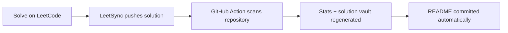

<div align="center">

<h1>🥋 Kaizen DSA Dojo</h1>

### 小さな改善、毎日。 · Small improvements, every day.

My living archive of LeetCode solutions—built one problem, one pattern, and one better decision at a time.

[](#-solution-vault)
[](.github/workflows/update-readme.yml)
[](LICENSE)

<br>

`Learn → Solve → Reflect → Repeat`

</div>

---

## ⚡ The dojo dashboard

<!-- LEETSYNC:STATS:START -->
| Problems solved | Easy | Medium | Hard | Languages |
|:---:|:---:|:---:|:---:|:---:|
| **0** | 🟢 0 | 🟡 0 | 🔴 0 | — |
<!-- LEETSYNC:STATS:END -->

> [!TIP]
> This dashboard and the solution vault maintain themselves. Every LeetSync push triggers the [README workflow](.github/workflows/update-readme.yml), which discovers new solutions and rebuilds the sections between the automation markers.

## 🧭 Philosophy

**Kaizen** means continuous improvement. This repository is less about hoarding accepted answers and more about building durable instincts: recognize the pattern, choose the right data structure, explain the trade-off, and return later with a sharper solution.

```
       understand
           ↓
  model → implement → verify
    ↑                    ↓
    └────── reflect ─────┘
```

## 🗂️ Solution vault

Search by problem, jump straight to the code, or use the difficulty and language columns to explore the collection.

<!-- LEETSYNC:SOLUTIONS:START -->
_The mats are ready. The first synced solution will appear here automatically._
<!-- LEETSYNC:SOLUTIONS:END -->

## 🔄 How the self-updating index works



The generator supports the usual LeetSync layout (`0001-two-sum/0001-two-sum.py`), recognizes solution files in nested folders, reads difficulty from problem README files when available, and keeps all hand-written content outside its markers untouched.

<details>
<summary><strong>Run the indexer locally</strong></summary>

```bash
python3 .github/scripts/update_readme.py
```

If the generated sections are already current, the command makes no changes.

</details>

## 🤝 Explore, learn, improve

If a solution gives you a useful idea, feel free to star the repository. If you spot a clearer approach or a worthwhile trade-off, open an issue—good dojos get stronger through thoughtful review.

<div align="center">

### Progress over perfection. Consistency over intensity.

Made with discipline, curiosity, and a lot of test cases by [Parth Ajmera](https://github.com/Vortex-ParthAjmera).

</div>

